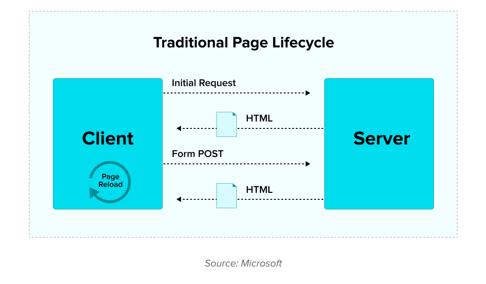
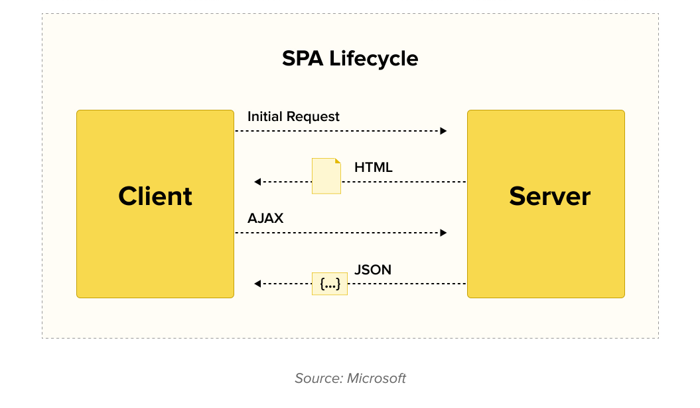

# React intro

[tsevdos.me](https://tsevdos.me/) / [@tsevdos](https://twitter.com/tsevdos)

---

# Agenda

All the content can be found [here](https://github.com/codehub-learn/react-pfizer).

- project setup
- SPA (single page application)
- JavaScript / ES2015+ intro

---

# Rules

Feel free to interrupt me for:

- questions
- relevant comments

---

# Setup

Make sure your installation is working ([instructions](https://github.com/codehub-learn/react-pfizer)).

---

# Project

- [repository](https://github.com/codehub-learn/react-pfizer/tree/master/project)
- run locally
- user stories

---

# Project presentation

- 5 - 10' minutes
- problems and solutions
- what did you like and what you did not
- design patterns and best practises
- extra modules / packages
- anything else worth mentioning

---

# Multi-page application

- client-server architecture
- server does all the work
- client (browser) just renders

---

# Multi-page application



---

# Multi-page application advantages

- SEO
- monolith
- caching

---

# Multi-page application disadvantages

- server load / resources
- bandwidth
- monolith (separation of concerns)
- slower UX / UI

---

# Single-page application

- client-server architecture
- server and client do their own part
- client is another app

---

# Single-page application



---

# Single-page application advantages

- you have 2 applications to deal
- reduce server load / resources
- less bandwidth
- separation of concerns
- faster UX / UI

---

# Single-page application disadvantages

- you have 2 applications to deal
- slow initial page (?)
- SEO

---

# JavaScript / ECMAScript history

- 1995 **Brendan Eich (Netscape)** builds JS in 10 days!!!
- May 1995: **Mocha** project starts
- September 1995: first release of **LiveScript**
- December 1995: renamed to **JavaScript**

---

# JavaScript / ECMAScript history

- 1996: ECMAScript (or ES) is part of the **ECMA standards organization** (European Computer Manufacturers Association)
- **ECMAScript** is the standard and **JavaScript** is the most popular implementation of the standard

---

# JavaScript / ECMAScript history

- ECMA Technical Committee 39 (TC39)
- June 1997: ES1 (ECMA-262)
- June 1998: ES2
- December 1999: ES3
- ES4 (abandoned)
- December 2009: ES5 (many OOP features, strict mode, JSON, many new features)

---

# JavaScript / ECMAScript history

- June 2015: ES6 or ES2015
  - classes
  - arrow functions
  - promises
  - template strings
  - transpilers (babel and tracer)
- ES2016 - ES2019

---

# JavaScript / ES2015+ intro

- var, let and const
- ES modules
- arrow functions
- promises and async/await
- classes
- default parameters
- ternary, logical or & nullish coalescing operators
- optional chaining

---

# JavaScript / ES2015+ intro

- shorthand object assignment
- destructuring assignment (arrays/objects)
- spread operator
- rest operator
- template literals
- map, reduce and filter

---

# var, let and const

- don't use var anymore, use let or const
- var (function scope)
- let / const (block scope)
- with const you cannot re-assign the value

---

# ES modules

- default import / export modules
- named import / export modules
- a module can have **only one** default and/or many named exports

---

# ES default export modules

```js
// 1
export default function add(a, b) {
  return a + b;
}

// 2
export default {
  key: "test",
};

// 3
export default ClassName;
```

---

# ES default import modules

```js
// 1
import add from "path/to/module"

// 2
import myObj from "path/to/module"

// 3
import ClassName as MyClass from "path/to/module"
```

---

# ES named export modules

```js
// 1
export function add(a, b) {
  return a + b;
}

// 2
export const configuration = {
  key: "test",
};

// 3
export ClassName;
```

---

# ES named import modules

```js
// 1
import { add, multiply } from "path/to/module";

// 2
import { configuration } from "path/to/module";

// 3
import { ClassName as MyClass } from "path/to/module";
```

---

# Arrow functions

- syntax
- context / scope ("this" remains the same)
- implicit return
- you cannot use it as constructor function

---

# Arrow functions

```js
function getGreeting() {
  return "Welcome to JavaScript";
}

const getGreeting = () => {
  return "Welcome to JavaScript";
};

const getGreeting = () => "Welcome to JavaScript";
```

---

# Arrow functions

```js
const getFive = () => 5;

const addFive = (a) => a + 5;

const add = (a, b) => a + b;
```

---

# Promises and async / await

- manage asynchronous code
- built-in data structure
- async / await syntax is a special syntax for dealing with promises

---

# Promises

```js
const myPromise = new Promise((resolve, reject) => {
  setTimeout(() => {
    if (true) {
      resolve("Happy path!");
    } else {
      reject(Error("Something went wrong."));
    }
  }, 2000);
});

myPromise
  .then((data) => {
    console.log(data);
  })
  .catch((error) => {
    console.log(error.message);
  });
```

---

# Fetch API

```js
fetch("http://api.icndb.com/jokes/random")
  .then((res) => res.json())
  .then((data) => {
    console.log(data);
  })
  .catch((error) => {
    console.log(error);
  });
```

---

# Async / await

```js
async function getJoke() {
  try {
    const res = await fetch("http://api.icndb.com/jokes/random");
    const data = await res.json();
    console.log(data);
  } catch (error) {
    console.log(error);
  }
}

getJoke();
```

---

# Classes

- prototypal Inheritance (prototype chain)
- syntactic sugar

---

# Classes

```js
class Developer {
  constructor(name) {
    this.name = name;
  }

  hello() {
    return "Hi I am " + this.name + " the  developer";
  }
}

const me = new Developer("John");
me.hello();
```

---

# Classes

```js
class ReactDeveloper extends Developer {
  likesReact() {
    return true;
  }
}
```

---

# Default parameters

```js
function hello(name = "stranger") {
  return "Hello " + name + "!";
}

hello(); // Hello stranger!
hello("John"); // Hello John
```

---

# Ternary, logical or & nullish coalescing operators

```js
// Ternary
const price = hasVAT ? 5 : 7;

// logical or
const myName = name || "stranger";

// nullish coalescing
const myVal = val ?? 100;
```

---

# Optional chaining

```js
// ES5
const streetName = user && user.address && user.address.street;

// with optional chaining
const streetName = user?.address?.street;
```

---

# Shorthand object assignment

```js
const name = "John";
const surname = "Tsevdos";
const age = 38;

const john = { name, surname, age };

// ES5
const john = { name: name, surname: surname, age: age };
```

---

# Destructuring assignment (object)

```js
const developer = {
  name: "John",
  surname: "Tsevdos",
  developer: true,
  age: 38,
};

const { name, surname, age } = developer;
console.log(name);
console.log(surname);
console.log(age);
```

---

# Destructuring assignment (array)

```js
const languages = ["JavaScript", "TypeScript", "Rust", "Java"];

const [js, ts, , j] = languages;
console.log(js);
console.log(ts);
console.log(j);
```

---

# Spread operator

```js
// object
const john = {
  name: "John",
  surname: "Tsevdos",
  age: 38,
};

const reactDeveloper = {
  skills: ["JavaScript", "React"],
  OOP: true,
  yearsOfExpirience: 12,
};

const johnDev = { ...john, ...reactDeveloper };
console.log(johnDev);
```

---

# Spread operator

```js
// arrays
const favoriteLanguages = ["JavaScript", "TypeScript"];
const learningLanguages = ["Rust", "Dart"];

const all = [...favoriteLanguages, ...learningLanguages];
console.log(all);
```

---

# Rest operator

```js
// object
const john = {
  name: "John",
  surname: "Tsevdos",
  age: 38,
};

const { age, ...rest } = john;
console.log(rest);
```

---

# Rest operator

```js
// arrays
const languages = ["Rust", "Dart", "JavaScript", "TypeScript"];
const [r, d, ...rest] = languages;

console.log(rest);
```

---

# Template literals

```js
const greeting = "Hello";
const subject = "World";

console.log(greeting + " " + subject + "!");
console.log(`${greeting} ${subject}!`);
```

---

# Array methods: map()

```js
const array = [1, 4, 9, 16];

const map = array.map((x) => x * 2);
```

---

# Array methods: reduce()

```js
const array = [1, 4, 9, 16];

const total = array.reduce(
  (accumulator, currentValue) => accumulator + currentValue
);
```

---

# Array methods: filter()

```js
const languages = ["JavaScript", "TypeScript", "Rust", "Java"];

const result = languages.filter((language) => language.length > 4);
```

---

# That's all folks

### Questions / Discussions?
