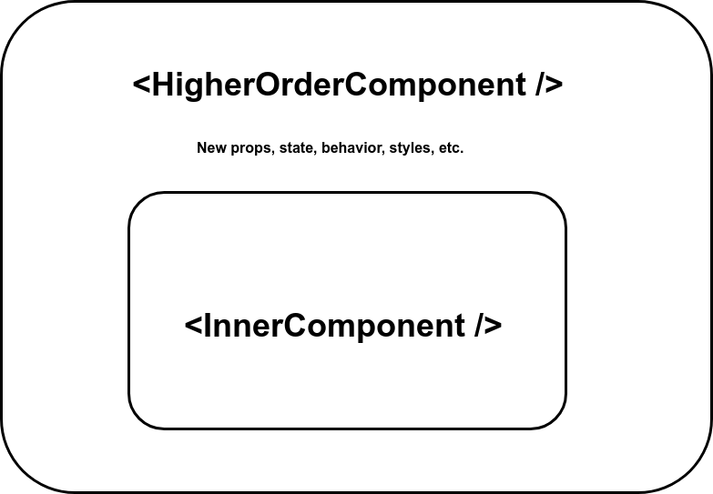

# React Patterns

[tsevdos.me](https://tsevdos.me/) / [@tsevdos](https://twitter.com/tsevdos)

---

# Agenda

All the content can be found [here](https://github.com/codehub-learn/react-pfizer).

- stateful and stateless components
- higher-order components (HoC)
- render props
- custom hooks

---

# Rules

Feel free to interrupt me for:

- questions
- relevant comments

---

# Stateful and stateless components

- presentational and container components
- smart and dumb component
- seperation of concerns
- easier to reuse
- better structure
- designer friendly

---

# Stateful components

- are concerned with how things work
- provide the data and behavior to stateless or other stateful components
- call actions and provide these as callbacks to the stateless components
- connect with stores (redux, mobx, etc.)

---

# Stateless components

- simple
- are concerned with how things look (UI)
- event handling
- JSX
- performance

---

# Stateful and stateless components

Examples.

---

# Stateful and stateless components exercise

(./src/examples/SSC/exercise/UserCard.js)

1. Create a UserCardContainer stateful component that will keep all the state and logic
2. Extract the UI to a stateless UserCard component

---

# Higher-order components (HoC)

A higher-order component is a function that takes a component and returns a new component.

A higher-order component (HoC) is an advanced technique in React for reusing component logic. HoCs are not part of the React API, but a pattern that emerges from React’s compositional nature.

---

# FP concepts

- pure functions
- immutability
- currying
- higher-order functions

---

# Pure functions

- given the same input, will always return the same output
- produce no side effects (ex. API calls, updating DOM, subscribing to event listeners - anything where you want an "imperative" action to happen)

---

# Pure functions

```js
function add(num1, num2) {
  return num1 + num2;
}

const add = (num1, num2) => num1 + num2;
```

---

# Pure functions?

```js
let total = 5;
function add(num1, num2) {
  const result = total + num1 + num2;
  return result;
}

//---------------
function add(num1, num2) {
  console.log(num1, num2);
  return num1 + num2;
}
```

---

# Immutability

- once it's created it can’t be changed
- it will have the same properties and values forever
- makes our objects/state/values more predictable
- less bugs

---

# Currying

Is the process of transforming a function that takes multiple arguments into a series of functions that take one argument at a time.

---

# Currying

```js
// Sum function
const sum = function (a, b) {
  return a + b;
};

// Curried sum function
const curriedSum = function (a) {
  return function (b) {
    return a + b;
  };
};

const result1 = sum(2, 3); // 5
const result2 = curriedSum(2)(3); // 2 + 3 // 5
```

---

# Currying

```js
// Sum function
const sum = (a, b) => a + b;

// Curried sum function
const curriedSum = (a) => (b) => a + b;

const result1 = sum(2, 3); // 5
const result2 = curriedSum(2)(3); // 2 + 3 // 5

const addTwo = curriedSum(2); // 2 + b
const result3 = addTwo(5); // 7
```

---

# Higher-order function

A higher order function is a function that either takes one or more functions as arguments or returns a function as its result or both.

---

# Higher-order function

```js
/// normal function
function add(x, y) {
  return x + y;
}

// HoF
function higherOrderFunction(x, callback) {
  return callback(x, 5);
}

higherOrderFunction(10, add);
```

---

# Higher-order function

```js
// normal functions
const add = (...values) => values.reduce((a, b) => a + b);
const multiply = (...values) => values.reduce((a, b) => a * b);

// Calculator (higher-order function)
const calculator = (command) => (...args) => command(...args);

const addition = calculator(add);
const multiplication = calculator(multiply);

const total = addition(3, 6, 9, 12, 15, 18); // 63
const otherTotal = multiplication(2, 4, 3); // 24
```

---

# What higher-order components (HoC) can do?

- code reuse, logic and bootstrap abstraction
- render highjacking
- state and props abstraction and manipulation

---

# Higher-order components (HoC)

```jsx
const EnhancedComponent = (InputComponent) => {
  return EnhancedComponent;
};

// or simply
const EnhancedComponent = (InputComponent) => EnhancedComponent;
```

---

### Higher-order component (HoC)



---

# Higher-order components (HoC)

Examples.

---

# Higher-order components exercise

(./src/examples/HoC/exercise/UserCard.js)

1. create a HoC "withUser()"
2. keep the same functionality
3. the HοC will fetch the user data and pass them to the "enhanced" component as props
4. make the "UserCard" component stateless
5. Use it as: <UserCard title="My card" />

---

## Higher-order components considerations

- a HoC should be a pure function with no side-effects. It should not make any modifications and just compose the original component by wrapping it in another component
- do not use HoC’s in the render method of a component. Access the HoC outside the component definition
- refs are not passed through

---

# Render props

a “render prop” is simply a prop that takes a function which returns elements that will be used in render()

---

# Render props

solves the problems a HoC solves

---

# Render props

```js
const Component = (props) => props.renderProp();
// or
const Component = (props) => props.children();
```

---

# Render props

Examples.

---

# Render props exercise

(./src/examples/RP/exercise/UserCard.js)

1. create a "User" component that will provide the user data using a render prop
2. keep the same functionality
3. make the UserCard component stateless and use the User component to render the data

---

# Render props considerations

- callback hell

---

# Render props > HoCs

- simpler (not ES6 classes / hight-order functions)
- clarity (we know exactly from which component our props came)
- no need to create a new component
- no need to rename (avoid naming collisions)

---

# Custom hooks

Custom hooks are a mechanism to reuse stateful logic (such as setting up a subscription and remembering the current value), but every time you use a custom Hook, all state and effects inside of it are fully isolated.

---

# Custom hooks

- reuse stateful logic between components
- simplify components (easy to understand)
- share logic between different components and lifecycle methods
- easier and more flexible pattern from render props and higher-order components

---

# Custom hooks rules

- only call hooks from React function components
- only call hooks at the top level
- don’t call hooks inside loops, conditions, or nested functions
- custom hooks start with useSomething PascalCase function

---

# Custom hooks

Examples.

---

# Custom hooks

(./src/examples/hooks/exercise/UserCard.js)

1. create a custom "useUser" custom hook
2. keep the same functionality
3. use the custom hook to get the user data on the UserCard component

---

# Custom hooks > Render props

- better abstraction
- easier sharing
- encapsulation
- cleaner logic for side effects

---

# Compound components

Compound components is a pattern where components are used together such that they share an implicit state that lets them communicate with each other in the background. A compound component is composed of a subset of child components that all work in tandem to produce some functionality

---

# Compound components

> Think of compound components like the <select> and <option> elements in HTML. Apart they don’t do too much, but together they allow you to create the complete experience. — [Kent C. Dodds](https://kentcdodds.com/)

---

# HTML elements

```html
<select id="programming-languages">
  <option value="javascript">JavaScript</option>
  <option value="typescript">TypeScript</option>
  <option value="rust">Rust</option>
  <option value="go" selected>Go</option>
</select>
```

---

# Compound components

- [React.Children.map](https://reactjs.org/docs/react-api.html#reactchildrenmap)
- [React.cloneElement()](https://reactjs.org/docs/react-api.html#cloneelement)
- [Context API ](https://reactjs.org/docs/context.html)

---

# Compound components benefits

- flexible
- cleaner API
- customizable
- reusable

---

# Compound components

Examples.

---

# Recap

- Stateful and stateless components
- Higher-order components (HoC)
- Render props
- Custom hooks
- Compound components

---

# Provider Pattern

- application level (global) state
- react Context
- providers and consumers

---

# That's all folks

### Questions / Discussions?
